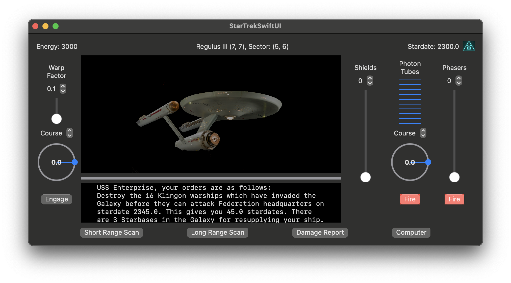
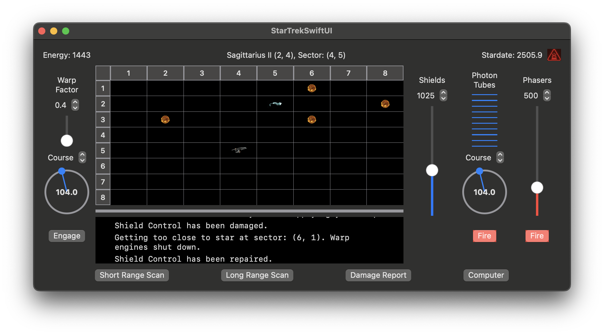
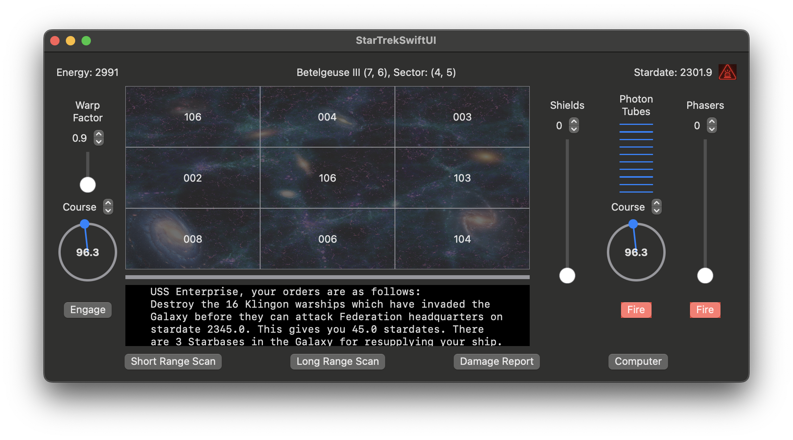
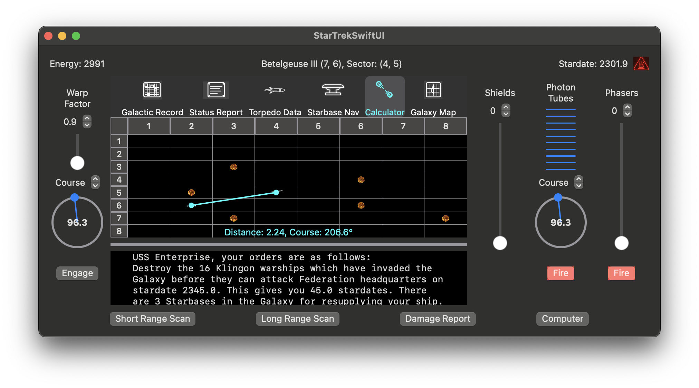

# Super Star Trek with UI

A macOS implementaiton of the 1978 Super Star Trek game but with a SwiftUI graphical user interface.  The underlying game mechanics remain the same as the 1978 BASIC game but a user-interface is provided for point-and-click operations. You can click on a Sector and the warp factor, navigation course, and torpedo course will automatically be set to that Sector assuming the computer subsystem is not damaged.  Similary, you can navigate to the center of an adjancet Quadrant by clicking on a Quadrant in the Long Range Sensor view.

## Screenshots
**Figure 1: Initial Screenshot**

**Figure 2: Short Range Sensor Screenshot**

**Figure 3: Long Range Sensor Screenshot**

**Figure 4: Computer: Metric Calculator Screenshot**

## Dependencies
- macOS 12.0+ (Monterey or later)
- [Xcode 14+](https://developer.apple.com/xcode/)

## Author 
Kevin Lynch

## License
Distributed under the MIT license. 

